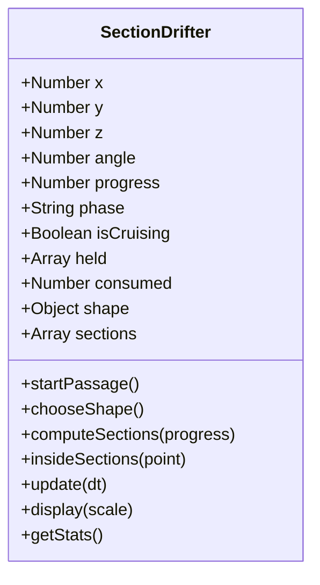

# M2 物種日誌與課前準備：截游體（Section Drifter）

> 本文件為物種設計筆記、研究出處與技術選型紀錄。關鍵事實請作者回原始文獻查證；個人設計理由與報告心得由作者自行撰寫。

---

## 一、物種設定書（五欄核心設定）

依據《世界觀整理.txt》第十一節的世界觀統一設定：

| 類別 | 設定內容 |
| --- | --- |
| **年代** | 宇宙被高維生命重啟後約數百萬到數千萬年。世界已建立起穩固的「點 → 線 → 面 → 體」幾何階級結構與不同維度生態層。舊宇宙的物質化學規律已蕩然無存，只偶爾在交會處殘留無法被幾何規則解釋的資訊碎片。 |
| **環境** | 由巨型幾何結構與多維生態層構成（本觀測站為二維平面層 02）。環境中沒有土壤、水或大氣，而是由網格座標、平面沉積區（Strata）、原點（Origin）與資訊波流動構成。 |
| **生存** | 生物透過吸收其他結構的「幾何資訊／能量」維生。高維生命穿過低維層時，透過截面包含低維節點並將其帶離平面，轉換為自身能量。 |
| **棲息** | 不同生命棲息於不同維度。截游體生活在三維空間（Volume），但其賴以維生的低維資訊密集存在於二維生態層，因此牠週期性地「潛入／穿透」二維平面進行掠食。 |
| **繁殖** | 不需要血肉卵生或性生殖。生物演化的是控制自身幾何拓樸的能力，透過拓樸分割（Topology Splitting）、出芽、複製特徵頂點等幾何分裂方式繁衍後代。 |

---

## 二、主角物種：截游體（Section Drifter）設計選擇

### 1. 牠的一生與觀察視角
- **真實本體**：生活在三維世界的高維幾何生命體。
- **低維觀察者的視野**：二維生命無法理解「上方（Z 軸）」，只能看見牠穿過平面時留下的截面輪廓。
- **生命週期演進（以環體形態為例）**：
  $$\text{三維巡游} \longrightarrow \text{切點接觸 (·)} \longrightarrow \text{單一截面擴張 (○)} \longrightarrow \text{臨界收腰} \longrightarrow \text{雙截面分離 (○ ○)} \longrightarrow \text{雙截面接回} \longrightarrow \text{縮小為點} \longrightarrow \text{消失返回三維}$$
- **捕食法則**：低維生命無法主動升維。當截游體的切面覆蓋到二維游離點時，該點在原位漸漸淡出（在低維生物眼中宛如被圓形黑洞吞噬憑空蒸發），象徵被高維生命抽離二維層，帶入三維世界。

---

## 三、技術研究先行與幾何數學依據

做新東西前，先做深度研究並比較技術方案（開源、穩定、可驗證）：

| 幾何本體 | 穿過平面截面變化 | 取捨與評估 | 參考文獻 |
| --- | --- | --- | --- |
| **環體 (Torus) [採用]** | 點 → 卵形 → 收腰 → 雙圓截面 → 接回 → 消失 | 完美呈現世界觀設定中的「單體分裂成多個截面」，幾何邏輯嚴密，在二維畫面極具識別度。 | [Thomas Banchoff: Slicing Doughnuts and Bagels](https://www.math.brown.edu/tbanchof/Beyond3d/chapter3/section08.html) / [Wolfram MathWorld: Spiric Section](https://mathworld.wolfram.com/SpiricSection.html) |
| **球體 (Sphere)** | 點 → 圓形擴張 → 圓形縮小 → 消失 | 最直觀的高維切片幾何，計算精準，但無法展現截面分裂。 | [Wolfram MathWorld: Sphere](https://mathworld.wolfram.com/Sphere.html) |
| **橢球 (Ellipsoid)** | 點 → 橢圓擴張 → 縮小 → 消失 | 增加了方向性與長短軸比例，適合作為不同發育時期的物種變體。 | [Wolfram MathWorld: Ellipsoid](https://mathworld.wolfram.com/Ellipsoid.html) |
| **斜切立方體 (Cube)** | 點 → 三角形/四邊形/五邊形/六邊形 → 消失 | 呼應多邊形幾何語彙，但屬於凸多面體，在空間中無法分裂成兩塊截面。 | [Banchoff: Hexagonal Slices of the Cube](https://www.math.brown.edu/tbanchof/HexCentralSlices/HexCentralSlices4308.html) |

### 環體切面數學解析推導
令環體實心在三維座標系 $(u, v, z)$ 的方程為：
$$(\sqrt{u^2 + z^2} - R)^2 + v^2 \le r^2$$
其中 $R$ 為環體大半徑（Major radius），$r$ 為管半徑（Tube radius）。
二維觀測平面設置在 $z = \text{depth}$：
- 當 $|\text{depth}| > R + r$：無交集（三維巡游）。
- 當 $|\text{depth}| = R + r$：相切於單一點。
- 當 $R - r < |\text{depth}| < R + r$：單一連通的凹腰橢圓形截面。
- 當 $|\text{depth}| = R - r$：臨界自交頸部（Lemniscate 形態）。
- 當 $|\text{depth}| < R - r$：中間甜甜圈空洞切穿，自然分裂為兩個獨立的閉合截面！
- 當 $\text{depth} = 0$：恰為兩個相距 $2R$、半徑為 $r$ 的圓。
- **中央空洞判定**：當 $(u, v) = (0, 0)$ 且 $\text{depth} = 0$ 時，方程式左邊為 $(0 - R)^2 + 0 = R^2 > r^2$，判定不在生物體內，因此環體中央空隙絕不會誤吃二維節點，完全符合真實幾何拓樸！

---

## 四、物件導向（OOP）架構解析

本站配合「物件導向程式設計」課程，以 ES6 Class 封裝物種：

- **屬性（Properties，生物狀態）**：
  - `this.z`：三維空間中的深度座標，決定切在生物的哪個部位。
  - `this.progress`：0 到 1 的生命週期進程。
  - `this.shape`：三維本體形態（環體、球體、橢球、立方體）。
  - `this.sections`：二維平面上即時計算出的切面頂點列表。
  - `this.held` / `this.consumed`：捕食管理系統。
- **方法（Methods，生物行為）**：
  - `startPassage()`：開始新一輪穿越，規劃平滑貝茲路徑。
  - `update(dt)`：推進時間、解出當前截面，並對二維世界進行捕食偵測。
  - `display(scale)`：在畫布上渲染高維截面細線輪廓、邊界採樣點與節點淡出效果。
  - `insideSections(point)`：以三維解析幾何判定節點是否落入生物體內。

---

## 五、驗證紀錄

1. **語法檢查**：`node --check m2-species/sketch.js` 通過。
2. **單元與邏輯測試**：`node m2-species/tests/drifter.cjs` 通過。
   - 環體切面分裂（centerSections = 2）驗證通過。
   - 中央空洞不捕食（`!insideSections(center)`）驗證通過。
   - 捕食與節點淡出守恆（nodes → held → consumed）驗證通過。
   - 6,000 幀長時無窮迴圈穩定性（無 NaN、無出界）驗證通過。
