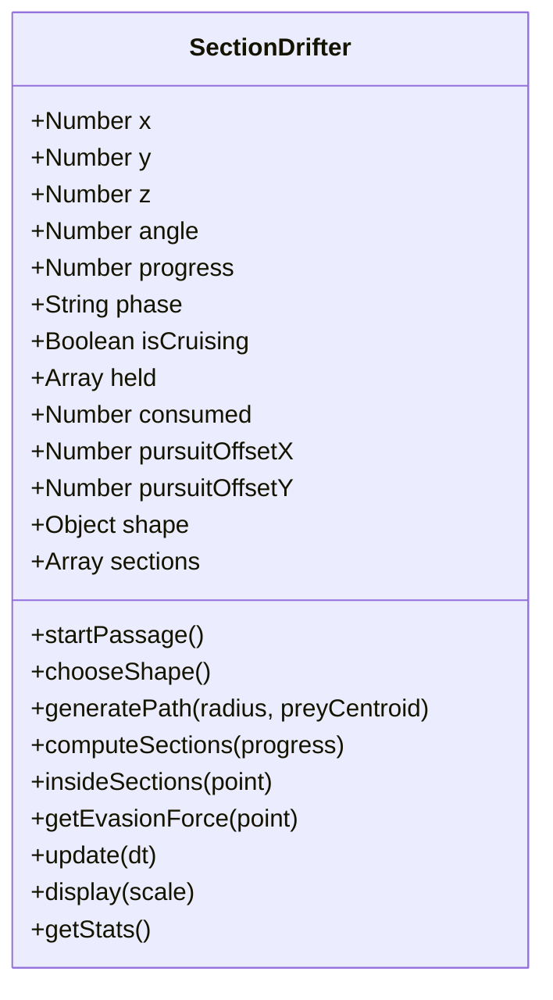

# M2 物種日誌與課前準備：截游體（Section Drifter）

> 本文件為物種設計筆記、研究出處與技術選型紀錄。關鍵事實請作者回原始文獻查證；個人設計理由與報告心得由作者自行撰寫。

---

## 一、物種設定書（五欄核心設定）

依據《世界觀整理.txt》第十一節的世界觀統一設定：

| 類別 | 設定內容 |
| --- | --- |
| **年代** | 宇宙被高維生命重啟後約數百萬到數千萬年。世界已建立起穩固的「點 → 線 → 面 → 體」幾何階級結構與不同維度生態層。舊宇宙的物質化學規律已蕩然無存，只偶爾在交會處殘留無法被幾何規則解釋的資訊碎片。 |
| **環境** | 由巨型幾何結構與多維生態層構成（本觀測站為二維平面層 02）。環境中沒有土壤、水或大氣，而是由網格座標、平面沉積區（Strata）、原點（Origin）與資訊波流動構成。 |
| **生存** | 生物透過吸收其他結構的「幾何資訊／能量」維生。高維生命穿過低維層時，透過截面包含低維節點並將其帶離平面，轉換為自身能量。 |
| **棲息** | 不同生命棲息於不同維度。截游體生活在三維空間（Volume），但其賴以維生的低維資訊密集存在於二維生態層，因此牠週期性地「潛入／穿透」二維平面進行掠食。 |
| **繁殖** | 不需要血肉卵生或性生殖。生物演化的是控制自身幾何拓樸的能力，透過拓樸分割（Topology Splitting）、出芽、複製特徵頂點等幾何分裂方式繁衍後代。 |

---

## 二、主角物種：截游體（Section Drifter）設計選擇

### 1. 牠的一生與觀察視角
- **真實本體**：生活在三維世界的高維幾何生命體。
- **低維觀察者的視野**：二維生命無法理解「上方（Z 軸）」，只能看見牠穿過平面時留下的截面輪廓。
- **生命週期演進（以環體形態為例）**：
  $$\text{三維巡游} \longrightarrow \text{切點接觸 (·)} \longrightarrow \text{單一截面擴張 (○)} \longrightarrow \text{臨界收腰} \longrightarrow \text{雙截面分離 (○ ○)} \longrightarrow \text{雙截面接回} \longrightarrow \text{縮小為點} \longrightarrow \text{消失返回三維}$$
- **捕食法則**：低維生命無法主動升維。當截游體的切面覆蓋到二維游離點時，該點在原位漸漸淡出（在低維生物眼中宛如被圓形黑洞吞噬憑空蒸發），象徵被高維生命抽離二維層，帶入三維世界。

---

## 三、技術研究先行與幾何數學依據

做新東西前，先做深度研究並比較技術方案（開源、穩定、可驗證）：

| 幾何本體 | 穿過平面截面變化 | 取捨與評估 | 參考文獻 |
| --- | --- | --- | --- |
| **環體 (Torus) [採用]** | 點 → 卵形 → 收腰 → 雙圓截面 → 接回 → 消失 | 完美呈現世界觀設定中的「單體分裂成多個截面」，幾何邏輯嚴密，在二維畫面極具識別度。 | [Thomas Banchoff: Slicing Doughnuts and Bagels](https://www.math.brown.edu/tbanchof/Beyond3d/chapter3/section08.html) / [Wolfram MathWorld: Spiric Section](https://mathworld.wolfram.com/SpiricSection.html) |
| **球體 (Sphere)** | 點 → 圓形擴張 → 圓形縮小 → 消失 | 最直觀的高維切片幾何，計算精準，但無法展現截面分裂。 | [Wolfram MathWorld: Sphere](https://mathworld.wolfram.com/Sphere.html) |
| **橢球 (Ellipsoid)** | 點 → 橢圓擴張 → 縮小 → 消失 | 增加了方向性與長短軸比例，適合作為不同發育時期的物種變體。 | [Wolfram MathWorld: Ellipsoid](https://mathworld.wolfram.com/Ellipsoid.html) |
| **斜切立方體 (Cube)** | 點 → 三角形/四邊形/五邊形/六邊形 → 消失 | 呼應多邊形幾何語彙，但屬於凸多面體，在空間中無法分裂成兩塊截面。 | [Banchoff: Hexagonal Slices of the Cube](https://www.math.brown.edu/tbanchof/HexCentralSlices/HexCentralSlices4308.html) |

### 環體切面數學解析推導
令環體實心在三維座標系 $(u, v, z)$ 的方程為：
$$(\sqrt{u^2 + z^2} - R)^2 + v^2 \le r^2$$
其中 $R$ 為環體大半徑（Major radius），$r$ 為管半徑（Tube radius）。
二維觀測平面設置在 $z = \text{depth}$：
- 當 $|\text{depth}| > R + r$：無交集（三維巡游）。
- 當 $|\text{depth}| = R + r$：相切於單一點。
- 當 $R - r < |\text{depth}| < R + r$：單一連通的凹腰橢圓形截面。
- 當 $|\text{depth}| = R - r$：臨界自交頸部（Lemniscate 形態）。
- 當 $|\text{depth}| < R - r$：中間甜甜圈空洞切穿，自然分裂為兩個獨立的閉合截面！
- 當 $\text{depth} = 0$：恰為兩個相距 $2R$、半徑為 $r$ 的圓。
- **中央空洞判定**：當 $(u, v) = (0, 0)$ 且 $\text{depth} = 0$ 時，方程式左邊為 $(0 - R)^2 + 0 = R^2 > r^2$，判定不在生物體內，因此環體中央空隙絕不會誤吃二維節點，完全符合真實幾何拓樸！

### 雷諾茲轉向行為：追捕（Pursuit）與逃跑（Evasion）研究先行

做新機制前，參考自律個體領域經典開源研究（Craig Reynolds, 1999）：

| 機制方案 | 運作原理 | 取捨與評估 | 參考出處 |
| --- | --- | --- | --- |
| **經典雷諾茲預測 Pursuit / Evade** | 計算目標未來預測點並轉向截擊；獵物預測掠食者未來點反向逃離。 | 智慧感最強，但截游體為三維巨物，靈敏轉彎易破壞高維沉重巡游的威嚴感。 | [Craig Reynolds: Steering Behaviors](http://www.red3d.com/cwr/steer/) / [Nature of Code Ch.6](https://natureofcode.com/autonomous-agents/) |
| **感應警戒逃跑 + 獵物質心追捕 [採用]** | 1. **逃跑**：警戒半徑 75px 內計算背離截面中心的 Flee 力，航速爆發提升 1.6 倍。 2. **追捕**：穿越貝茲路徑與切面中心向二維節點群「質心（Center of Mass）」微偏 40%，維持平滑宏觀巡游感。 | 最符合自然界巨型掠食者（如鬚鯨）與魚群之互動，視覺張力強且完全保持畫面簡潔優雅。 | [Craig Reynolds: Boids Flocking](https://www.red3d.com/cwr/boids/) |
| **高維雙截面夾擊（Pincer Effect）[採用]** | 環體分裂為雙截面時，兩側截面同時施加背離推力，中間節點順著狹縫合力逃脫，伴隨微弱幾何資訊共振。 | 完美呼應世界觀「同一個三維生物在二維看起來像兩側夾擊的包抄圍捕」，幾何意義深刻。 | [Spiric Section](https://mathworld.wolfram.com/SpiricSection.html) |
| **升維拓樸撕裂晶格（方案 B 特效）[採用]** | 被吃掉節點在原地升維時，產生動態擴散的旋轉六邊形諧波、6 個頂點拓樸游離點與四向軸線投影十字針。 | 嚴格維持黑白高對比幾何美學，具體詮釋低維資訊被拉升至 Z 軸時的維度撕裂。 | [Casey Reas: Software Structures](https://art-science.hexagram.ca/softwarestructures/) / [Nature of Code: Oscillation](https://natureofcode.com/oscillation/) |

---

## 四、物件導向（OOP）架構解析

本站配合「物件導向程式設計」課程，以 ES6 Class 封裝物種：

- **屬性（Properties，生物狀態）**：
  - `this.z`：三維空間中的深度座標，決定切在生物的哪個部位。
  - `this.progress`：0 到 1 的生命週期進程。
  - `this.shape`：三維本體形態（環體、球體、橢球、立方體）。
  - `this.sections`：二維平面上即時計算出的切面頂點列表。
  - `this.pursuitOffsetX` / `this.pursuitOffsetY`：追捕時向二維獵物密集區微偏的動態偏移量。
  - `this.held` / `this.consumed`：捕食管理系統。
- **方法（Methods，生物行為）**：
  - `startPassage()`：開始新一輪穿越，規劃向獵物質心牽引的平滑貝茲路徑（追捕）。
  - `getEvasionForce(point)`：給定二維節點坐標，回傳其面臨截面迫近時的雷諾茲逃跑向量 `{ fx, fy }` 與恐慌度 `panicLevel`。
  - `update(dt)`：推進時間、解出當前截面、施加微動態追捕，並對二維世界進行捕食偵測。
  - `display(scale)`：在畫布上渲染高維截面細線輪廓、邊界採樣點與節點淡出效果。
  - `insideSections(point)`：以三維解析幾何判定節點是否落入生物體內。

---

## 五、驗證紀錄

1. **語法檢查**：`node --check m2-species/sketch.js` 通過。
2. **單元與邏輯測試**：`node m2-species/tests/drifter.cjs` 通過。
   - 環體切面分裂（centerSections = 2）驗證通過。
   - 中央空洞不捕食（`!insideSections(center)`）驗證通過。
   - 捕食與節點淡出守恆（nodes → held → consumed）驗證通過。
   - 警戒逃跑力學（近距產生背離向量，遠距恐慌值為 0）驗證通過。
   - 雙截面夾擊合力逃生（水平力相互抵消，垂直力沿狹縫逃脫）驗證通過。
   - 6,000 幀長時無窮迴圈穩定性（無 NaN、無出界）驗證通過。
# 2026-10-07 隨機程度調整（AI 技術紀錄）

使用者希望減少兩種固定型態切換的感覺。沿用現有造型，不新增套件：每組截面增加獨立、不同長度的隨機時間軌，改變位置、轉角、曲率、長度、深度與斷裂程度。每個時間軌在目標之間用五次插值銜接，不逐幀重新抽 random；因此暫停、重畫與目標交接保持連續。

捕食時各段靠攏的進度不同，仍在完整閉合時共同形成有效包圍；包圍邊界的小幅變化同時用於繪圖與捕食判定。碎片共用主弧的形變，不變成無關粒子。調整入口為 DRIFTER.morphAmount 與 morphPeriod。請實際執行動畫，觀察變化是否符合自己的生命感設定；個人反思仍自行撰寫。

---

# 2026-10-07 多心截面修正（AI 技術紀錄）

使用者指出原造型仍像眼睛、漩渦或 C 型環。本輪針對已有造型修改，不新增工具或依賴：四組短弧改用不同錨點、曲率半徑、彎曲正負與朝向，彼此不共用主圓。疊相層具有獨立 XY 偏移、轉角、沿弧拉伸與曲率變化；相位仍由連續時間控制。

碎片透過 arcPoint() 延伸所屬主弧的參數範圍，是斷裂端點之外的小段截面，不再是環繞中心的裝飾三角形。捕食仍採閉合判定，但邊界改為偏折的非圓形曲線，其他深度層不一起縮成同心環。四狀態、突進、逃逸、帶離計數及世界互動保留。

已更新六階段離線造型圖，另補疊相朝向差、延伸弧段與邊界測試。圖像用來檢查靜態外觀，請仍在瀏覽器跑過動畫，並自行記錄對造型的觀察與選擇理由。

---

# 2026-10-07 斷環＋疊相技術筆記（AI 協作，非個人反思）

依使用者指定方向，先讀既有 SectionDrifter、世界對它的呼叫與測試，再擴充混合型；世界的節點更新、連線、地形、滑桿與按鈕邏輯未改動。

| 技術選項 | 優點 | 取捨／本次採用 |
|---|---|---|
| p5.js 連續 noise 變形 | 自由、有機，鄰近輸入有相近輸出 | 過度使用不容易維持物種輪廓；本次未新增 noise 依賴 |
| 固定偏心斷弧＋多頻率連續變形 | 靜止也保留特徵，參數容易解釋 | 是藝術化深度模型，不是新三維網格的精確求交；本次採用 |
| 真正三維網格與平面求交 | 能嚴格反映三維結構 | 要額外建模、求交及拓樸管理；本次保留原解析模型但不加入新網格系統 |

原始來源：[p5.js noise() 文件](https://p5js.org/reference/p5/noise/) 說明逐次 random 與連續 noise 的差異；[Reynolds Pursuit / Evasion](https://www.red3d.com/cwr/steer/PursueEvade.html) 說明以速度與位置預測目標。本次用平滑時間函數維持輪廓連續性，感知與突進仍採短時間位置預測。使用既有開源 p5.js，沒有增加執行期套件。

造型先行：四組弧帶，每組有固定不同的厚度、缺口與偏心；三層相位以不同頻率擺動，不持續等速自轉；五個固定碎片跟隨身體及感知方向。

行為接續：Idle 停留呼吸，Moving 前進且改變深度，Sensing 穩定鎖定節點並偏轉輪廓，Feeding 蓄力突進後重新排列斷環。閉合前中心是空的，閉合瞬間以同一可見邊界判斷是否包住獵物；逃出的不會被移除。成功捕食後相位錯位迅速增強再平滑恢復，仍使用原 held → consumed 流程。

效能範圍：預設 4 組 × 2 段 × 3 層，共 24 條弧帶；每半段 24 次取樣。碎片固定 5 個，殘影及漣漪按時間清除；突進保留 1/120 秒內的更新小步。這些是數量限制，不等於實際瀏覽器幀率保證。

驗證：新行為測試與既有測試通過，另外從真正的 displayBody() 繪圖方法產生六種階段的 SVG／PNG，檢查靜態形狀。本機瀏覽器工具因無法可靠確認網址而終止，因此未完成實際瀏覽器動畫、效能與按鈕操作驗證。請親自跑過程式、核對引用來源；個人研究結論、選擇理由及反思仍由作者自己寫。

---

# 2026-10-07 動作調整筆記（AI 協作，較早版本）

需求：截游體穿越二維時增加瞬間位移捕捉，具有池塘生物的動作節奏。

做法比較：持續平滑追逐較柔和，但捕食意圖不明顯；直接瞬移較強烈，但難以看懂路徑，也容易漏掉沿途捕食；本次採短蓄力加快速突進，保留可見的移動過程，搭配短殘影及淡漣漪。沿用既有開源 p5.js，不加入額外套件。

參考：[Craig Reynolds 的 Pursuit / Evasion 原始示範](https://www.red3d.com/cwr/steer/PursueEvade.html) 使用獵物位置與速度預測追逐目標。本次僅借用短時間預測概念；蓄力、突進與冷卻時間是作品的動畫參數，不代表真實池塘生物的生物學數據。

實作：依實際截面中心選目標，環體中央空洞仍不捕食；突進更新拆成最多 1/120 秒小步檢查捕食，限制輪廓留在畫布內。暫停時動作與特效時間一併停止。

請自己開啟網頁實際觀察動作節奏，並回原始來源查證參考概念；個人設計理由與反思請自行補寫。
